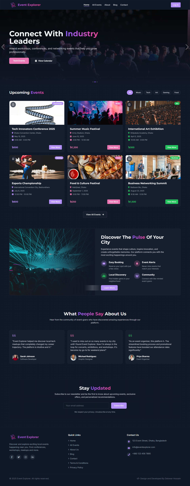

# 🎉 Event Explorer - Local Event Discovery Platform

**Event Explorer** is a vibrant, urban-themed local event discovery platform that enables users to discover, explore, and get details about upcoming local events such as conferences, workshops, sports events, art exhibitions, and more. Users can log in, browse events, view detailed information, and leave feedback or ratings for events they attend.

## 🌐 Live URL
**[Event Explorer Live Demo](https://event-discovery-hub.surge.sh/)**

## 📸 Website Preview

### 🖼️ Homepage Screenshot

*Homepage showcasing the vibrant urban-themed design with event slider and upcoming events section*

### 🌐 Live Website Preview

#### 🖥️ Desktop Preview
<iframe src="https://event-discovery-hub.surge.sh/" width="100%" height="600" frameborder="0" scrolling="yes" style="border: 2px solid #ddd; border-radius: 8px; margin: 10px 0; box-shadow: 0 4px 8px rgba(0,0,0,0.1);">
  <p>Your browser does not support iframes. <a href="https://event-discovery-hub.surge.sh/" target="_blank">Click here to visit the website</a></p>
</iframe>

#### 📱 Mobile Preview
<div style="display: flex; justify-content: center; margin: 20px 0;">
  <iframe src="https://event-discovery-hub.surge.sh/" width="375" height="667" frameborder="0" scrolling="yes" style="border: 2px solid #333; border-radius: 25px; margin: 10px; box-shadow: 0 8px 16px rgba(0,0,0,0.2);">
    <p>Your browser does not support iframes. <a href="https://event-discovery-hub.surge.sh/" target="_blank">Click here to visit the website</a></p>
  </iframe>
</div>

*🎯 Interactive preview of the live website - you can navigate and explore all features directly from here!*

> **💡 Pro Tip**: Try clicking on different sections, test the authentication, and explore the responsive design in both desktop and mobile views above!

## 📋 Project Purpose
This platform serves as a comprehensive solution for local event discovery, allowing users to:
- Discover exciting local events happening in their area
- Get detailed information about events including dates, locations, and entry fees
- Reserve seats for events they're interested in attending
- Manage their profile and saved events
- Read blogs and articles about events and entertainment


## ✨ Key Features

### 🔐 Authentication System
- **Email/Password Authentication** with secure validation
- **Google Sign-in** for quick access
- **Forget Password** functionality with email reset
- **Profile Management** with updateProfile() method
- **Show/Hide Password** toggle on registration
- **Persistent Login** - User stays logged in after page reload

### 🎯 Event Discovery
- **Interactive Slider** with minimum 3 slides showcasing featured events
- **Upcoming Events Section** displaying 6+ events in card layout
- **Event Details Page** (Protected Route) with comprehensive information
- **Seat Reservation System** with form validation
- **Dynamic Event Categories** (Tech, Art, Sports, etc.)

### 🛡️ Security & Privacy
- **Protected Routes** for sensitive pages
- **Environment Variables** for Firebase configuration
- **Private Route Redirection** to login when not authenticated
- **Secure Firebase Integration** with proper error handling

### 📱 Responsive Design
- **Mobile-First Approach** with Tailwind CSS
- **Tablet & Desktop Optimized** layouts
- **Urban-Themed UI** with vibrant design elements
- **Dark Theme** interface for better user experience

### 🎨 UI/UX Features
- **Dynamic Page Titles** for each route
- **Loading States** with custom animations
- **Toast Notifications** for user feedback
- **Sweet Alert** for confirmations and success messages
- **AOS Animations** for smooth scroll effects
- **Swiper Slider** for interactive carousels

### 🔄 Additional Features
- **404 Error Page** with custom design
- **Blog System** with detailed articles
- **Contact Page** for user inquiries
- **Terms & Privacy Pages** for legal compliance
- **Saved Events** functionality for logged-in users

## 🛠️ Tech Stack & NPM Packages

### Core Technologies
- **Frontend**: React 18.3.1, Vite 5.4.14, TailwindCSS 3.4.17
- **Backend**: Express.js 4.21.2, Node.js
- **Authentication**: Firebase 11.6.1
- **Hosting**: Firebase Hosting
- **Routing**: React Router DOM 7.5.3

### UI Components & Styling
- **@radix-ui/react-*** - Complete UI component library
- **lucide-react** 0.453.0 - Modern icon library
- **tailwind-merge** 2.6.0 - Utility for merging Tailwind classes
- **tailwindcss-animate** 1.0.7 - Animation utilities
- **class-variance-authority** 0.7.1 - Component variant management

### Animations & Interactions
- **aos** 2.3.4 - Animate On Scroll library
- **framer-motion** 11.13.1 - Advanced animations
- **swiper** 11.2.6 - Touch slider component
- **embla-carousel-react** 8.6.0 - Carousel component

### Forms & Validation
- **react-hook-form** 7.55.0 - Form management
- **@hookform/resolvers** 3.10.0 - Form validation resolvers
- **zod** 3.24.2 - Schema validation

### Notifications & Alerts
- **react-hot-toast** 2.5.2 - Toast notifications
- **sweetalert2** 11.6.13 - Beautiful alert dialogs

### Utilities & Tools
- **date-fns** 3.6.0 - Date manipulation
- **react-helmet** 6.1.0 - Dynamic document head management
- **react-countup** 6.5.3 - Animated counters
- **clsx** 2.1.1 - Conditional className utility

## 📋 Prerequisites

Before you begin, ensure you have the following installed:

- **Node.js** (version 18.0.0 or higher)
- **npm** (version 8.0.0 or higher)
- **Git**

Check your versions:
```bash
node --version
npm --version
git --version
```

## 🚀 Quick Start

### 1. Clone the Repository

```bash
git clone https://github.com/your-username/event-discovery-hub.git
cd event-discovery-hub
```

### 2. Install Dependencies

```bash
npm install
```

### 3. Environment Setup

**Option A: Quick Setup (Recommended)**
```bash
npm run setup
```
This interactive wizard will guide you through setting up your Firebase configuration.

**Option B: Manual Setup**
```bash
cp .env.example .env
```

Edit the `.env` file with your Firebase project credentials:

```env
# Firebase Configuration
VITE_FIREBASE_API_KEY=your_api_key_here
VITE_FIREBASE_AUTH_DOMAIN=your_project_id.firebaseapp.com
VITE_FIREBASE_PROJECT_ID=your_project_id
VITE_FIREBASE_STORAGE_BUCKET=your_project_id.appspot.com
VITE_FIREBASE_MESSAGING_SENDER_ID=your_sender_id
VITE_FIREBASE_APP_ID=your_app_id
VITE_FIREBASE_MEASUREMENT_ID=your_measurement_id
```

### 4. Firebase Setup

1. Go to [Firebase Console](https://console.firebase.google.com/)
2. Create a new project or use existing one
3. Enable Authentication with Email/Password and Google providers
4. Get your Firebase config from Project Settings
5. Update your `.env` file with the config values

### 5. Run the Development Server

```bash
npm run dev
```

The application will be available at `http://localhost:5173`

## 🏗️ Project Architecture

### Layout Structure
- **Navbar**: Website name, Home, My Profile with active route highlighting
  - Shows user image and name on hover when logged in
  - Shows login button when not authenticated
  - Logout functionality for authenticated users
- **Main Section**: Dynamic content based on routes
- **Footer**: Comprehensive footer with links, terms, privacy policy, and social media

### Route Structure
```
📁 Public Routes
├── / (Home) - Slider + Upcoming Events + 2 extra sections
├── /login - Email/Password + Google authentication
├── /register - Registration with validation
├── /forgot-password - Password reset functionality
├── /all-events - Browse all available events
├── /blog - Event-related articles and blogs
├── /contact - Contact form and information
├── /terms - Terms and conditions
├── /privacy - Privacy policy
└── /not-found - Custom 404 error page

🔒 Protected Routes (Require Authentication)
├── /event/:id - Event details with seat reservation
├── /profile - User profile management with updateProfile()
├── /about - Additional meaningful content page
└── /saved-events - User's saved events

🚫 Error Handling
└── /* - Redirects to 404 page for invalid routes
```

### JSON Data Structure
Events data includes:
- **thumbnail** - Event image hosted on imgbb/postimages
- **name** - Event title
- **category** - Event type (Tech, Art, Sports, etc.)
- **date** - Event date and time
- **location** - Event venue
- **entry_fee** - Ticket price
- **description** - Detailed event information
- **organizer** - Event organizer details

## 📁 File Structure

```
event-explorer/
├── client/                 # Frontend React application
│   ├── public/            # Static assets
│   │   └── data/          # JSON data files (events.json, blogs.json)
│   ├── src/               # Source code
│   │   ├── components/    # Reusable UI components
│   │   │   ├── ui/        # Radix UI components
│   │   │   ├── NavbarWithAuth.jsx
│   │   │   ├── FooterWithAuth.jsx
│   │   │   └── ResponsiveLayout.jsx
│   │   ├── pages/         # Page components
│   │   │   ├── Home.jsx
│   │   │   ├── EventDetails.jsx (Protected)
│   │   │   ├── Profile.jsx (Protected)
│   │   │   ├── Login.jsx
│   │   │   ├── Register.jsx
│   │   │   ├── ForgetPassword.jsx
│   │   │   ├── NotFound.jsx
│   │   │   └── ExtraPage.jsx (Protected)
│   │   ├── routes/        # Route configurations
│   │   │   └── PrivateRoute.jsx
│   │   ├── context/       # React context providers
│   │   │   └── AuthContext.jsx
│   │   ├── lib/           # Utilities and configurations
│   │   │   ├── firebase.js
│   │   │   ├── sweetAlert.js
│   │   │   └── toastUtils.js
│   │   ├── hooks/         # Custom React hooks
│   │   └── assets/        # Images and static files
│   └── index.html         # HTML template
├── server/                # Backend Express server
├── shared/                # Shared utilities and schemas
├── dist/                  # Build output
├── firebase.json          # Firebase hosting configuration
├── .firebaserc           # Firebase project configuration
└── .env                  # Environment variables (not in repo)
```

## 🔧 Available Scripts

```bash
# Setup
npm run setup           # Interactive setup wizard
npm run setup-check     # Verify project setup

# Development
npm run dev             # Start development server
npm run build           # Build for production (cross-platform)
npm run build:windows   # Build for production (Windows)
npm run build:linux     # Build for production (Linux/Mac)
npm start               # Start production server
npm run preview         # Preview production build

# Database
npm run db:push         # Push database schema changes

# Code Quality
npm run lint            # Run ESLint
npm run lint:fix        # Fix ESLint issues
npm run format          # Format code with Prettier

# Deployment
npm run deploy          # Build and deploy to Firebase
npm run deploy:surge    # Build and deploy to Surge.sh

# Maintenance
npm run clean           # Clean install dependencies
npm run audit-fix       # Fix security vulnerabilities
```

## 🔥 Firebase Configuration & Requirements

### Authentication Setup
1. **Enable Authentication**:
   - Go to Firebase Console → Authentication → Sign-in method
   - Enable "Email/Password" and "Google" providers
   - **Important**: Do NOT enable email verification (as per requirements)

2. **Configure Google Sign-in**:
   - Add your domain to authorized domains
   - Configure OAuth consent screen
   - Add authorized domains for deployment (Netlify/Surge if used)

3. **Password Requirements**:
   - Must have an Uppercase letter
   - Must have a Lowercase letter
   - Length must be at least 6 characters

### Key Features Implementation

#### 🔐 Authentication Features
- ✅ **Email/Password Login** with validation
- ✅ **Google Sign-in** integration
- ✅ **Registration** with name, email, photoURL, password
- ✅ **Forget Password** functionality (redirects to Gmail)
- ✅ **Show/Hide Password** toggle on registration
- ✅ **Profile Management** using Firebase updateProfile()
- ✅ **Persistent Login** - User info persists on reload
- ✅ **Loading States** during authentication

#### 🎯 Event System
- ✅ **Home Page** with slider (3+ slides) and upcoming events (6+ events)
- ✅ **Event Cards** with thumbnail, name, category, date, location, entry fee
- ✅ **Event Details Page** (Protected Route) with full information
- ✅ **Seat Reservation Form** with name and email fields
- ✅ **Success Messages** on form submission (no database storage)

#### 🛡️ Route Protection
- ✅ **Private Routes** for event details, profile, and extra pages
- ✅ **Login Redirect** for unauthenticated users
- ✅ **No Redirect on Reload** for authenticated users on private routes

#### 🎨 UI/UX Requirements
- ✅ **Responsive Design** - Mobile, tablet, and desktop
- ✅ **Dynamic Titles** for each page
- ✅ **Active Route Highlighting** in navbar
- ✅ **User Image Display** in navbar with hover name
- ✅ **404 Error Page** for invalid routes
- ✅ **Toast/Sweet Alert** for all error and success messages

#### 📦 Required Packages
- ✅ **Swiper Slider** for interactive carousels
- ✅ **AOS Animation** for scroll effects

### Hosting Setup

1. **Install Firebase CLI**:
```bash
npm install -g firebase-tools
```

2. **Login and Initialize**:
```bash
firebase login
firebase init hosting
```

3. **Deploy**:
```bash
npm run build
firebase deploy
```

4. **SPA Configuration**:
   - Firebase hosting is configured for SPA routing
   - 200.html fallback prevents 404 errors on route refresh
   - Surge.sh deployment includes 200.html for SPA routing support

## 🌐 Deployment

### Firebase Hosting (Primary)
The project is configured for Firebase Hosting with SPA routing support.

```bash
# Build and deploy
npm run deploy
```

### Surge.sh Hosting (Current Deployment)
This project is currently deployed on Surge.sh at: **https://event-discovery-hub.surge.sh/**

#### Quick Deploy to Surge.sh
```bash
# Using the npm script (recommended)
npm run deploy:surge
```

#### Manual Deploy to Surge.sh
```bash
# Build the project
npm run build

# Install Surge CLI globally (if not already installed)
npm install -g surge

# Deploy to Surge.sh
cd dist/public
surge . event-discovery-hub.surge.sh
```

#### Surge.sh Configuration
- **Domain**: event-discovery-hub.surge.sh
- **SPA Support**: 200.html fallback configured for React Router
- **Firebase Integration**: Domain added to Firebase authorized domains
- **SSL**: Automatically provided by Surge.sh

### Alternative Hosting Platforms
The built files in `dist/public/` can also be deployed to:
- **Firebase Hosting** - Primary hosting option
- **Netlify** - Add authorized domain to Firebase
- **Vercel** - Add authorized domain to Firebase
- **GitHub Pages** - Add authorized domain to Firebase

**Important**: When using any hosting platform, add your domain to Firebase authorized domains for authentication to work properly. For this project, `event-discovery-hub.surge.sh` has been added to Firebase authorized domains.

## 📊 Project Requirements Checklist

### ✅ Main Requirements
- [x] **Navbar** with website name, Home, My Profile, active routes
- [x] **User Authentication** with image display and hover name
- [x] **Login/Logout** functionality with proper state management
- [x] **Main Section** with dynamic content based on routes
- [x] **Footer** with relevant information and links
- [x] **Navbar/Footer** showing on all pages except 404

### ✅ JSON Data & Home Page
- [x] **Custom JSON data** with images hosted on imgbb/postimages
- [x] **Slider** with minimum 3 slides (using Swiper)
- [x] **Upcoming Events** section with 6+ events
- [x] **Event Cards** with thumbnail, name, category, date, location, entry fee
- [x] **"View More" button** linking to event details

### ✅ Event Details Page (Protected)
- [x] **Protected Route** redirecting to login if not authenticated
- [x] **Complete event information** display
- [x] **Seat Reservation Form** with name and email fields
- [x] **"Reserve Seat" button** with success message
- [x] **No redirect on reload** for authenticated users

### ✅ Authentication System
- [x] **Login Page** with email/password and Google login
- [x] **Register Page** with name, email, photoURL, password
- [x] **Password Validation** (uppercase, lowercase, 6+ characters)
- [x] **Google Authentication** integration
- [x] **Links between login/register** pages
- [x] **Toast/Sweet Alert** for all messages
- [x] **No email verification** (as required)

### ✅ Additional Requirements
- [x] **404 Page** with custom design
- [x] **Extra Protected Route** (/about) with meaningful content
- [x] **Dynamic Titles** for each page
- [x] **Persistent Login** with Firebase onAuthStateChanged
- [x] **Loading States** during authentication

### ✅ Challenge Features
- [x] **My Profile Page** with user info and edit functionality
- [x] **updateProfile()** method for name and photoURL updates
- [x] **Show/Hide Password** toggle on registration
- [x] **Swiper Slider** implementation
- [x] **AOS Animations** for scroll effects
- [x] **Forget Password** with email redirect to Gmail

### ✅ Technical Requirements
- [x] **Responsive Design** (mobile, tablet, desktop)
- [x] **Environment Variables** for Firebase configuration
- [x] **Unique Urban-themed Design** with vibrant UI
- [x] **Surge.sh Hosting** with SPA routing support (200.html fallback)
- [x] **Firebase Authorized Domain** added for Surge.sh deployment
- [x] **10+ Meaningful Git Commits** with descriptive messages

## 🔍 Troubleshooting

### Common Issues

1. **Firebase Configuration Error**:
   - Ensure all environment variables are set correctly
   - Check Firebase project settings
   - Verify API keys are valid
   - Run `npm run setup-check` to diagnose issues

2. **Authentication Issues**:
   - Verify Firebase Authentication is enabled
   - Check authorized domains in Firebase Console
   - Ensure password meets validation requirements

3. **Build Errors**:
   - Clear node_modules: `npm run clean`
   - Update dependencies: `npm update`
   - Check Node.js version compatibility

4. **Development Server Issues**:
   - Check if port 5173 is available
   - Clear browser cache
   - Restart the development server

5. **Route Issues**:
   - Verify protected routes redirect to login
   - Check if user persists on page reload
   - Ensure 404 page shows for invalid routes

### Getting Help

- Run `npm run setup-check` for automated diagnostics
- Check browser console for error messages
- Review Firebase documentation
- Verify all environment variables are set

## 🚀 Performance Features

- **Code Splitting** with React.lazy for optimal loading
- **Image Optimization** with proper loading states
- **Responsive Images** for different screen sizes
- **Lazy Loading** for better performance
- **Optimized Bundle** with Vite build optimization

## 🔒 Security Features

- **Environment Variables** for sensitive configuration
- **Protected Routes** with authentication checks
- **Input Validation** on all forms
- **XSS Protection** with proper sanitization
- **HTTPS Enforcement** on production

## 📱 Mobile Features

- **Touch-Friendly** interface design
- **Swipe Gestures** for sliders and carousels
- **Responsive Navigation** with mobile menu
- **Optimized Performance** for mobile devices
- **PWA Ready** structure for future enhancement

## 🎯 Future Enhancements

- Email verification (disabled for assignment requirements)
- Event booking with payment integration
- User reviews and ratings system
- Event calendar integration
- Push notifications for event reminders
- Social sharing features
- Advanced search and filtering

## 📄 License

This project is licensed under the MIT License - see the [LICENSE](LICENSE) file for details.

## 🙏 Acknowledgments

- [React](https://reactjs.org/) - UI library
- [Firebase](https://firebase.google.com/) - Backend services
- [Tailwind CSS](https://tailwindcss.com/) - CSS framework
- [Radix UI](https://www.radix-ui.com/) - UI components
- [Vite](https://vitejs.dev/) - Build tool
- [Swiper](https://swiperjs.com/) - Touch slider
- [AOS](https://michalsnik.github.io/aos/) - Animate on scroll

---

**Event Explorer** - Discover Amazing Local Events 🎉
Made with ❤️ for the community
